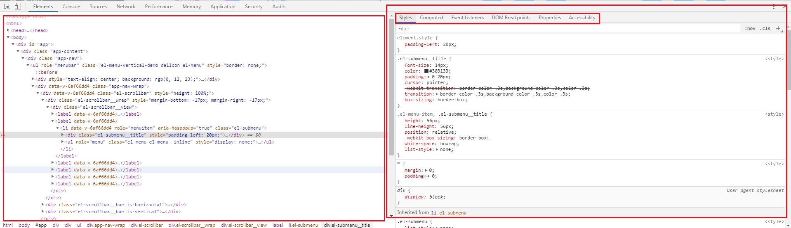
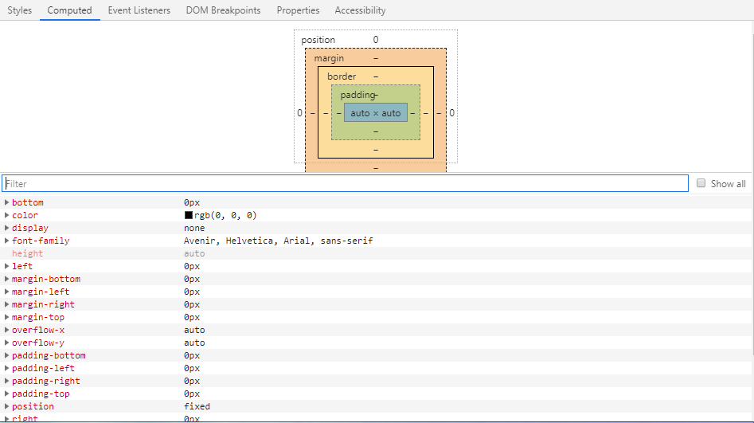
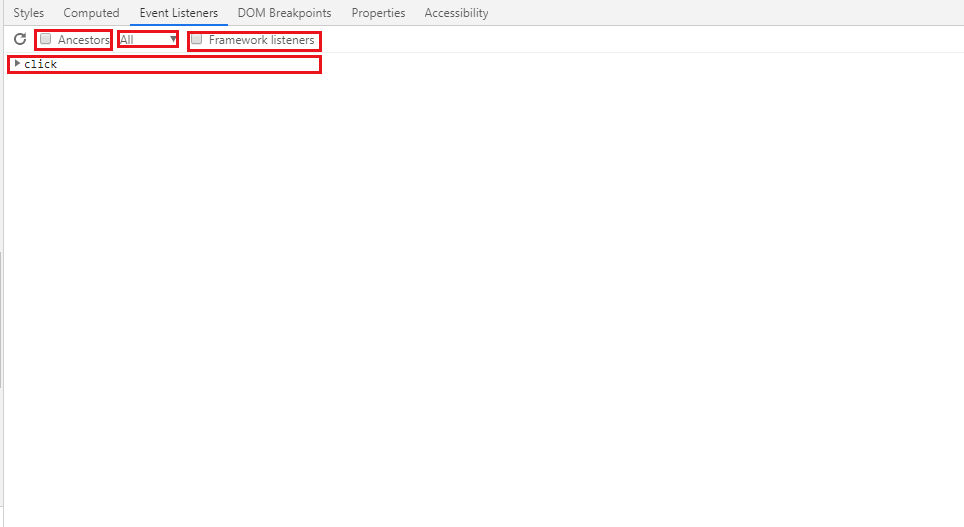
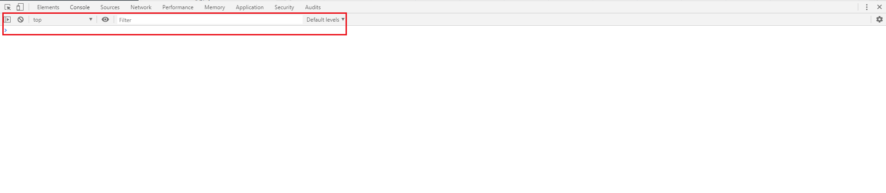

#JS总结第一章
##&ensp;&ensp;&ensp;&ensp;第一节 Chrome 调试工具
###&ensp;&ensp;&ensp;&ensp;&ensp;&ensp;&ensp;&ensp;1.1 调试面板
  
  
    1.Elements主要用来查看最终渲染情况，CSS样式的修改和绑定事件的定位
      
     
    
        1).分为两个部分
            - 左面部分为网页最终渲染后的文档结构，包括css与js渲染
            - 右面部分
                * Styles 所选元素的当前页面渲染后的样式，包括样式结构和类名，可以进行手动输入、调节样式
                
  
                
                * Computed 可以对选中元素的样式进行总览，可以直观的展现盒模型模型  
                
  
                 
                * Event Listeners 可以获取选中元素的绑定事件
                    **  Ancestors  是否显示父类绑定事件
                    **  Passive & Blocking  被动事件监听器和事件监听器
                    **  Framework listener：勾选该项之后会去解析第三方框架/类库的封装代码，告诉开发者实际上该元素绑定事件的代码。
                            举个例子，在我们使用的jquery中，假如我们没有去勾选该项，那么定位到的事件绑定代码就是jquery内的源码，
                            不方便我们去定位业务代码，所以该项在平时使用的时候按需求来启动。
                * DOM Breakpoints 可以对DOM节点打断点，可以快速定位到改变该DOM元素的JS代码上
                * Properties 这是所选 DOM 节点对应的对象以及这个对象的父类、父类的父类...的集合。
    2.Console调试台，主要是用来打印输出内容，获取报错信息，页面调试内容（仅用于对在window对象中存在的对象或者变量，函数才可以使用）

        1) 作用  
            - 在开发过程中记录代码诊断信息
            - 与文档和 DevTools 交互的命令行工具
        2) 快捷键
            - Ctrl + Shift + J
            - 如果要同时打开其他面板与Console，直接按Esc即可
        3) 操作
            - 清空控制台数据 Ctrl + L
   
    3.Source源码界面，里面呈现的代码都是原文件的代码，主要的用途是用来对代码进行断点调试和代码测试  
    4.netWork 主要是查看网络环境包括报头和返回数据等参数  
    5.Performance 主要是用来查看JS计算性能相关的，一般如果是单纯的页面不包含canvas，大数据渲染等等的，一般是不需要使用到的  
    6.Memory 记录内存的情况  