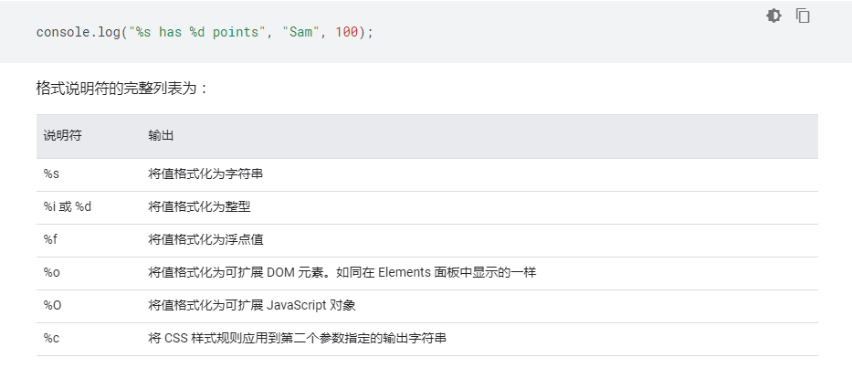

#JS总结第一章
##&ensp;&ensp;&ensp;&ensp;第一节 Chrome 调试工具
###&ensp;&ensp;&ensp;&ensp;&ensp;&ensp;&ensp;&ensp;1.1 调试面板
  
  
    1.Elements主要用来查看最终渲染情况，CSS样式的修改和绑定事件的定位
      
     
    
        1).分为两个部分
            - 左面部分为网页最终渲染后的文档结构，包括css与js渲染
            - 右面部分
                * Styles 所选元素的当前页面渲染后的样式，包括样式结构和类名，可以进行手动输入、调节样式
                
  
                
                * Computed 可以对选中元素的样式进行总览，可以直观的展现盒模型模型  
                
  
                 
                * Event Listeners 可以获取选中元素的绑定事件
                    **  Ancestors  是否显示父类绑定事件
                    **  Passive & Blocking  被动事件监听器和事件监听器
                    **  Framework listener：勾选该项之后会去解析第三方框架/类库的封装代码，告诉开发者实际上该元素绑定事件的代码。
                            举个例子，在我们使用的jquery中，假如我们没有去勾选该项，那么定位到的事件绑定代码就是jquery内的源码，
                            不方便我们去定位业务代码，所以该项在平时使用的时候按需求来启动。
                * DOM Breakpoints 可以对DOM节点打断点，可以快速定位到改变该DOM元素的JS代码上
                * Properties 这是所选 DOM 节点对应的对象以及这个对象的父类、父类的父类...的集合。
    2.Console调试台，主要是用来打印输出内容，获取报错信息，页面调试内容（仅用于对在window对象中存在的对象或者变量，函数才可以使用）

        1) 作用  
            - 在开发过程中记录代码诊断信息
            - 与文档和 DevTools 交互的命令行工具
        2) 快捷键
            - Ctrl + Shift + J
            - 如果要同时打开其他面板与Console，直接按Esc即可
        3) 操作
            - 清空控制台数据 Ctrl + L
        4) 过滤
            Verbose : 长消息
            Info : console.log()  普通信息
            Warnings : console.warn() 警告信息  将会有黄色的背景颜色
            Errors : console.error() 错误信息  将会有红色的背景颜色
            Filter box ： 过滤文本输入框
                1.可以是普通查找功能
                2.也可以写正则表达式，js正则
            Sidebar 左侧工具栏
                1.message  所有message以及其URL，来源
                2.user message 所有用户信息，过滤掉浏览器的信息
                3.errors    所有错误信息以及其URL，来源
                4.warnings  所有警告信息以及其URL，来源
                5.info 所有普通信息以及其URL，来源
                6.verbose 所有长消息以及其URL，来源
        5) Console中可以运行js
                常用的方法与表达式
                    - console.assert(expression, object)
                        当表达式返回false，输出object
                    - console.clear()
                        清空控制台  如果 Preserve Log 被开启, console.clear() 将被关闭.
                    - console.count([label])
                        统计日志输出次数
                    - console.countReset([label])
                        清除日志输出次数
                    - console.dir(object)
                        以JSON形式打印 object 
                    - console.error(object [, object, ...])
                        打印错误信息
                    - console.group(label) 打印信息组 初始样式为展开
                        例：
                            const label = '姓名信息组';
                            console.group(label);  // 组开始
                            console.info('Leo');
                            console.info('Mike');
                            console.info('Don');
                            console.info('Raph');
                            console.groupEnd(label);  // 组结束
                    - console.groupCollapsed(label) 同上 只不过初始样式为折叠
                        例：
                            const label = '姓名信息组';
                            console.groupCollapsed(label);  // 组开始
                            console.info('Leo');
                            console.info('Mike');
                            console.info('Don');
                            console.info('Raph');
                            console.groupEnd(label);  // 组结束
                - console.table(array)
                    将数组以表格的形式输出，更加直观
                - console.time([label]) && console.timeEnd([label])
                    输出之间代码运行时间
                    例：
                        console.time();
                        for (var i = 0; i < 100000; i++) {
                          let square = i ** 2;
                        }
                        console.timeEnd();
                        
                        ：default: 6.30029296875ms
                - console.trace() 打印方法栈
                    例：
                        const first = () => { second(); };
                        const second = () => { third(); };
                        const third = () => { fourth(); };
                        const fourth = () => { console.trace(); };
                        first();
                - 表达式
                    $_  ： 返回最近一次你使用的表达式
                    $0 - $4 ： 返回最近四次使用的表达式
                    $(selector, [startNode])  相当于  document.querySelector()
                    $$(selector, [startNode]) 相当于 document.querySelectorAll()
                - 其他方法
                    clear()  清空控制台的历史记录
                    copy(object)  将一个对象以字符串的形式粘贴到剪贴板上
                    debug(function) 会中断代码，调用调试器
                    undebug(function)  停止调用调试器
                    inspect(object/function)  直接跳入到方发或选中指定的元素
                    getEventListeners(object) 获取一个指定元素绑定的事件
                    keys(object) 获取一个指定对象的属性名称，以数组的形式
                    values(object) 获取一个指定对象的值，以数组的形式
                    monitor(function) 控制台输出调用函数名与参数
                    unmonitor(function) 停止监听方法运行
                    monitorEvents(object[, events]) 监听对象上的事件
                    unmonitorEvents(object[, events]) 停止监听对象上的事件
                    table(data[, columns]) 是指定的对象（对象数组）以表格的形势输出
                - 使用window.onerror(msg,url,line) 处理运行时异常
                  

  
        6) Console控制台设置
            - Hide Network 隐藏因网络问题而输出的日志
            - Preserve Log 刷新页面是否保存上一次的日志信息
            - Selected Context Only 过滤其他嵌入式页面页面的日志信息
            - Group similar 默认的消息组行为，暂且没有什么应用 
            - Log XMLHttpRequests 输出请求信息
            - Eager Evaluation 提前预演js执行结果
            - Autocomplete From History 显示执行历史记录   
                     
    3.Source源码界面，里面呈现的代码都是原文件的代码，主要的用途是用来对代码进行断点调试和代码测试  
    4.netWork 主要是查看网络环境包括报头和返回数据等参数  
    5.Performance 主要是用来查看JS计算性能相关的，一般如果是单纯的页面不包含canvas，大数据渲染等等的，一般是不需要使用到的  
    6.Memory 记录内存的情况  